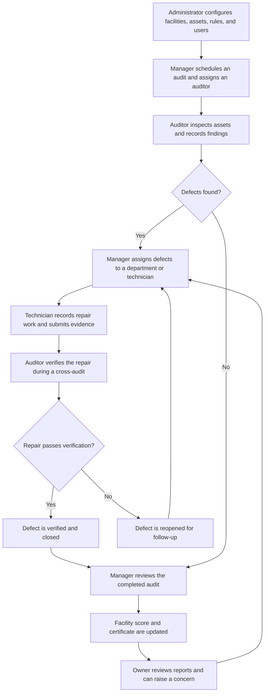
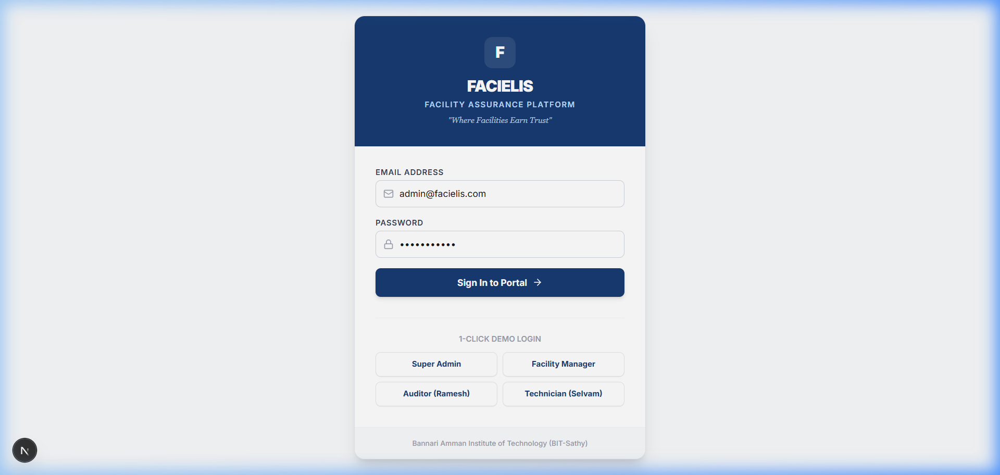
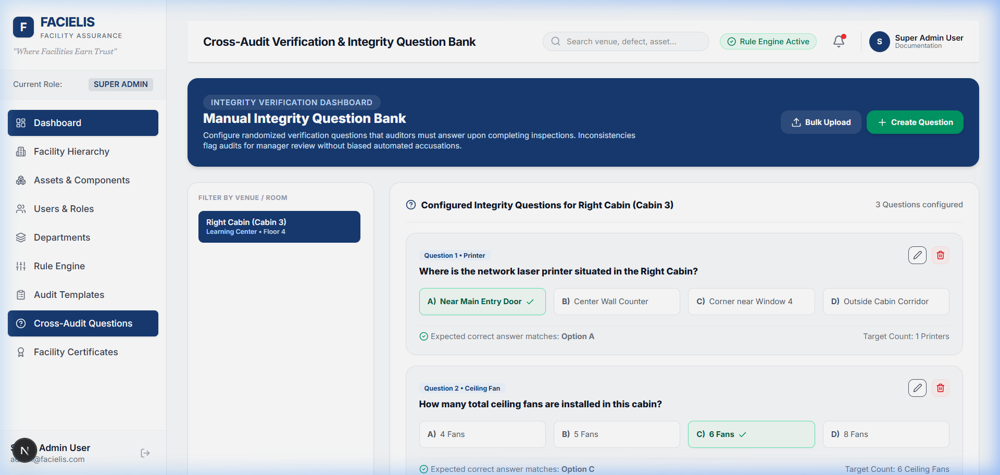
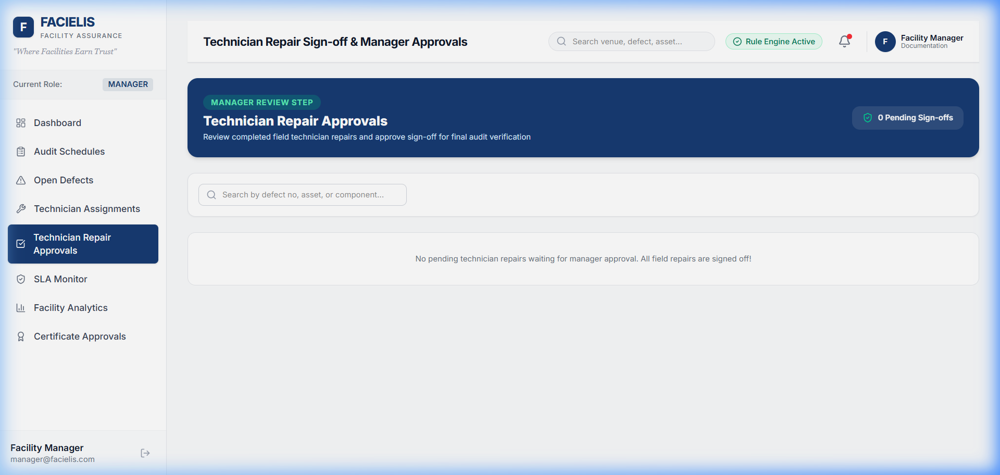

# FACIELIS

FACIELIS is a facility assurance platform for planning inspections, recording asset conditions, coordinating repairs, and keeping an auditable record of the work. It brings facility administrators, managers, auditors, technicians, and venue owners into one workflow.

## How the workflow works



Administrators maintain the organization, campus and building hierarchy, venues, asset categories, reference images, departments, inspection rules, users, and verification questions. Managers coordinate audit schedules, assignments, service levels, defect follow-up, and review. Auditors inspect assets against their reference standards, record findings and evidence, complete integrity checks, and verify repairs. Technicians document repair work and submit it for verification. Venue owners can review their facility information, respond to questions, and report defects.

Audits move through `IN_PROGRESS`, `PENDING_REVIEW`, and `COMPLETED`. Defects move through `OPEN`, `ASSIGNED`, and `REPAIRED_PENDING_CROSS` before they are either `VERIFIED` or `REOPENED`. Managers can review completed audit information and facility certificates are generated from audit results.

## Screenshots

| Sign in | Cross-audit | Repair review |
| --- | --- | --- |
|  |  |  |

## Technology

- Next.js 15, React 19, and TypeScript
- Express and Socket.IO for the API and real-time events
- PostgreSQL with Prisma
- Tailwind CSS

## Run locally

### Requirements

- Node.js and npm
- PostgreSQL

### 1. Install dependencies

```bash
npm install
```

### 2. Configure PostgreSQL

Create a PostgreSQL database for local development and add a `.env` file at the project root. `.env` is ignored by Git; do not commit database credentials.

```env
DATABASE_URL="postgresql://postgres:<your-password>@localhost:5432/facielis?schema=public"
JWT_SECRET="<a-long-random-secret>"
```

Change the username, password, host, port, or database name to match your PostgreSQL installation. If your password contains URI-reserved characters, URL-encode it in `DATABASE_URL`.

On Windows, `scripts/setup-local.ps1` can create the `facielis` database, apply the schema, seed demo data, and start the app. The script expects PostgreSQL 18 at `C:\Program Files\PostgreSQL\18\bin` and PostgreSQL listening on port `2425`. Run it from PowerShell:

```powershell
.\scripts\setup-local.ps1
```

The script prompts for the PostgreSQL `postgres` user password. If your installation uses a different version or port, configure PostgreSQL accordingly or use the manual steps below.

### 3. Apply the schema and add demo data

```bash
npx prisma db push
npx prisma db seed
```

**Seeding clears existing application records in the configured database before inserting demo data. Use a disposable local database; do not run the seed command against data you need to keep.**

### 4. Start the application

```bash
npm run dev
```

Open [http://localhost:3847](http://localhost:3847). The development command starts both the Next.js frontend on port `3847` and the Express API with Socket.IO on port `5000`.

To run either process separately, use two terminals:

```bash
npm run server
```

```bash
npx next dev --turbo -p 3847
```

The API health endpoint is [http://localhost:5000/api/health](http://localhost:5000/api/health). Set `PORT` to change the API port. If the API is hosted elsewhere, set `BACKEND_URL` for the Next.js API rewrite.

## Demo accounts

After seeding, each account below uses the password `password123`.

| Role | Email |
| --- | --- |
| Super administrator | `admin@facielis.com` |
| Manager | `manager@facielis.com` |
| Auditor | `auditor1@facielis.com` |
| Technician | `tech.elec@facielis.com` |
| Venue owner | `owner@facielis.com` |

These accounts and passwords are for local evaluation only. Do not use them for a deployed environment.

## Useful commands

| Command | Purpose |
| --- | --- |
| `npm run dev` | Start the frontend and API for local development |
| `npm run server` | Start only the API and Socket.IO server |
| `npm run build` | Build the Next.js application |
| `npm run start` | Start the API and the production frontend |
| `npm run db:push` | Apply the Prisma schema to the configured database |
| `npm run db:seed` | Reset application records and load demo data |
| `npm run db:studio` | Open Prisma Studio |

For a production build, first configure a production PostgreSQL database, then run `npx prisma db push`, `npm run build`, and `npm run start`. Keep credentials and signing secrets in the deployment environment, not in source control. Do not run the demo seed command on a production database.

## Project layout

```text
prisma/       Database schema and demo seed
public/       Reference images, uploads, and screenshots
scripts/      Local setup helpers
src/app/      Next.js pages and role-specific portals
src/components/ Shared interface components
src/engines/  Facility rules, scoring, and certificate logic
src/lib/      Database and authentication helpers
src/server/  Express API, routes, and Socket.IO server
```
